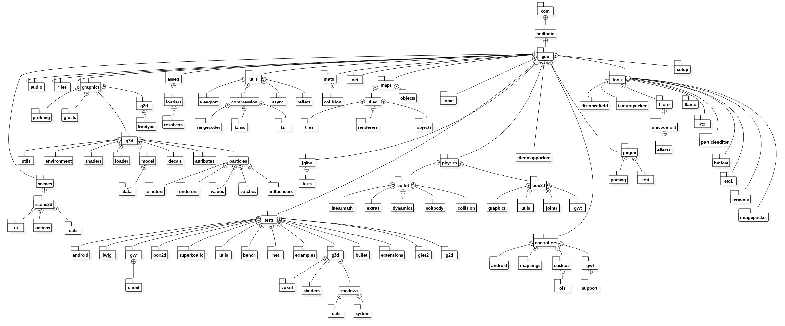
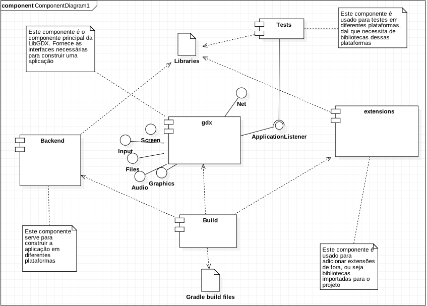
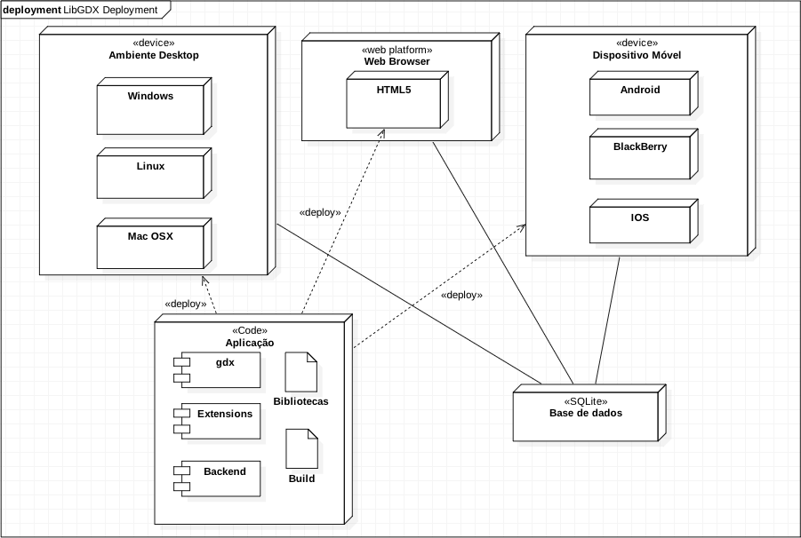

### MIEIC - Mestrado Integrado em Engenharia Informática e Computação
### ESOF - Engenharia de Software

## Index
1. [Introdução](#intro)
2. [Desenho da Arquitetura](#design)
  * [Visão de Arquitetura 4+1](#arqui)
     + [Logic View](#logic)
     + [Implementation View](#develop)
     + [Process View](#process)
     + [Deployment View](#physical)
3. [Conclusão](#conclusion)

## <a name="intro"> 1. Introdução

A _LibGDX_, apesar de ser um projeto sem clientes específicos, isto é, é construida a partir de novas ideias dadas pela organização _LibGDX_ ou até por qualquer pessoa que queira contribuir, não se distancia muito de outros projetos mais profissionais no que toca à sua organização de código e design.

Podemos, a partir do conteúdo disponibilizado no _Github_(pastas, ficheiros, código, recursos), desdobrar o projeto e tentar descrever a sua arquitetura, na medida do possível.

Este relatório aborda várias vistas de arquitetura, pelo que irá ser usado o modelo _4+1_ de arquitetura de software para as demonstrar.

## <a name="design"> 2. Desenho da Arquitetura

## <a name="arqui"> 4+1 Architectural View

Este modelo incorpora quatro vistas de arquitetura que irão ser apresentadas a seguir. Cada vista será representada por um diagrama correspondente. Em algumas vistas foi difícil representar a arquitetura no seu todo pois trata-se de um projeto de grande dimensão e bastante complexo.

### <a name="logic"> Logic View

A vista da lógica é representada por um diagrama de pacotes que mostra o agrupamento dos diferentes elementos do software. No caso do LibGDX temos um pacote que engloba todos os outros, denominado _gdx_. Também existem dependências com pacotes pertencentes às bibliotecas "standard" de Java, mas por razões de praticidade decidimos não as incluir no diagrama, representando apenas o que diz respeito apenas ao próprio _LibGDX_.

Dentro do pacote _gdx_ ainda podemos distinguir um outro pacote _tests_ que se dedica à maioria dos testes, e os pacotes _tools_, _physics_, _controllers_, _tiledmappacker_, _freetype_, _jnigen_ e _setup_ que compõem as extensões dos quais um projecto que use esta framework pode, ou não usar, não fazendo parte do núcleo essencial do _LibGDX_.

### <a name="develop"> Implementation View

A vista de implementação é representada por diagramas de componentes que mostram os componentes do software e as dependências entre eles. No caso do projeto _LibGDX_ temos um conjunto de componentes que formam a parte central do software denominada por _gdx_ e os restantes que o rodeiam.

Existem também outros componentes importantes que são utilizados para construir a aplicação em diversas plataformas, uma das características da _LibGDX_. São necessários alguns ficheiros, sendo a maioria ficheiros de configuração.

No diagrama seguinte não estão representados todos os componentes da _LibGDX_, pois só estão representados os componentes mais importantes.

### <a name="process"> Process View

### <a name="physical"> Deployment View

Como este software é principalmente conhecido pela sua flexibilidade no que toca a desenvolvimento para várias plataformas em simultâneo com o mesmo código de base, a _deployment view_ vai ser representada por diversos nós que representam os diversos dispositivos e ambientes em que a aplicação gerada poderá correr.

## 3. <a name="conclusion"> Conclusão

Sendo o projeto _LibGDX_ um projeto não comercial, isto é, não existe a venda do framework pois todas as pessoas podem descarregar e usufruir deste gratuitamente, não tem os mesmos métodos de trabalho e desenvolvimento que um produto mais virado para o comércio teria. Consequentemente, a sua arquitetura não está tão bem organizada e foi por vezes um desafio conseguir extrapolar um diagrama que representasse corretamente esta. Foi particularmente difícil no diagrama de processos pois, tratando-se de uma framework, a _LibGDX_ não é um programa já bem definido que o utilizador corre como seria de esperar de uma aplicação, mas sim uma biblioteca de ferramentas desenhada para o utilizador conseguir criar e desenvolver as suas próprias aplicações.
