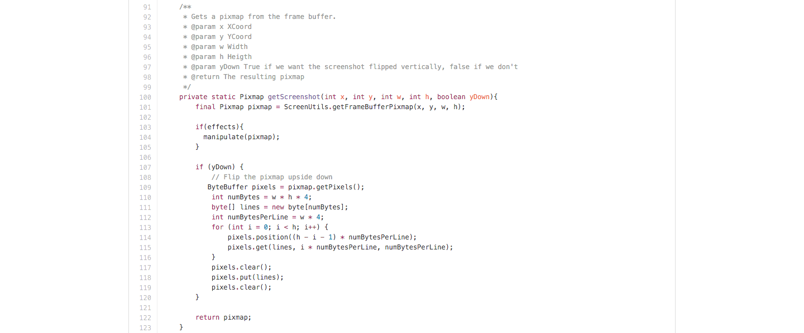
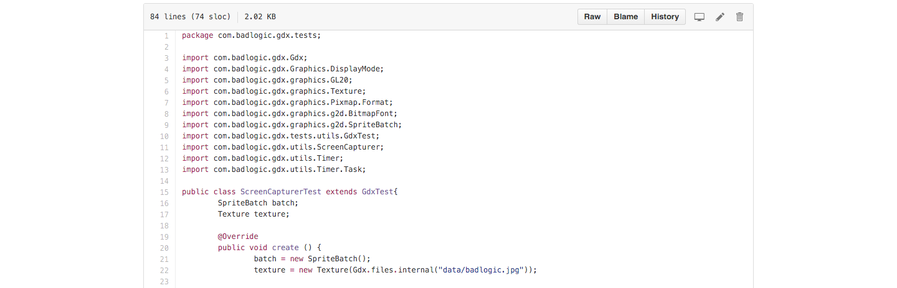

### MIEIC - Mestrado Integrado em Engenharia Informática e Computação
### ESOF - Engenharia de Software

# Implementação e melhoramento de uma _feature_

## Índice
1. [Introdução](#intro)
2. [_Feature_: Captura de ecrâ](#feature)
   * 2.1. [Antes da feature](#before)
   * 2.2. [Componentes](#comp)
   * 2.3 [Objetivo](#objective)
   * 2.4 [Código](#code)
   * 2.5 [Testes](#testes)
   * 2.6 [_Pull Request_](#pull)
4. [Conclusão](#conclusion)

## <a name="intro"> 1. Introdução

Este _deliverable_ tem como objetivo mostrar os vários elementos que fizeram parte da integração de uma nova _feature_ no projeto da _framework_ LibGDX.

Abordar-se-á os componentes que rodeiam a nova _feature_ assim como o seu objetivo, partes fundamentais do seu código e consequentemente o _pull request_ da mesma submetido através do Github.

## <a name="intro"> 2. _Feature_: Captura de Ecrâ

A LibGDX por já ter sido usada anteriormente para outros projetos por todos os elementos do grupo, surgiram certas necessidades práticas que a _framework_ não conseguia fornecer no seu estado atual. Uma dessas necessidades era capturar uma imagem a partir da tela da aplicação. Decidiu-se por isso escolher esta funcionalidade para implementar e melhorar.

### <a name="before"> 2.1 Antes da _feature_

Esta funcionalidade já poderia ser implementada a partir de outros recursos que a LibGDX fornecia. Aliás, existe na própria _wiki_ desta uma implementação que ajuda o utilizador a fazer uma captura de ecrâ:

Retirada de: https://github.com/libgdx/libgdx/wiki/Take-a-Screenshot

Porém a LibGDX não contém uma classe capaz de gerir esta funcionalidade, isto é, esconder a parte do código desnecessária e substitui-la por funções intuitivas e fáceis de usar.

### <a name="comp"> 2.2 Componentes

Os componentes que rodeiam esta funcionalidade são:
  * __java.nio.ByteBuffer__: Responsável pela parte da manipulação dos bytes do _fram buffer_.
  * __com.badlogic.gdx.files__: Responsável pelo tratamento e manipulação dos ficheiros e do sistema de ficheiros.
  * __com.badlogic.gdx.graphics__: Trata da parte da manipulação de imagem: cores, _pixmap_, e _frame buffer_.

  
  Retirada de: https://github.com/PedroRomanoBarbosa/libgdx/blob/capturer/gdx/src/com/badlogic/gdx/utils/ScreenCapturer.java

### <a name="objective"> 2.3 Objetivo

O objetivo desta funcionalidade é a capacidade do utilizador, a um dado momento do ciclo de vida da aplicação, poder capturar o ecrâ ou até uma parte dele através de abstração fornecida por uma classe. Assim o utilizador não precisará de perceber o código subjacente à funcionalidade. Só terá de usar os métodos fornecidos pela nova classe chamada __ScreenCapturer__.

Para além disso, o utilizador poderá também escolher se quer aplicar o efeito de tom de cinza a aplicar à imagem, podendo a qualquer momento voltar ao modo normal e vice-versa.

Um objetivo que não chegou a ser concretizado foi o aumento ou diminuição do brilho e da saturação devido a complicações da parte técnica e por ser algo secundário comparado com o resto.

### <a name="code"> 2.4 Código

O código acrescentado e mudado separa-se em 2 partes: a nova classe implementada e a classe de teste. Esta secção aborda a primeira.

A nova classe criada chama-se __ScreenCapturer__ e através dos seus métodos permite o utilizador capturar a tela de visualização enquanto a aplicação corre. Esta classe encontra-se no diretório __libgdx/gdx/src/com/badlogic/gdx/utils/__.

Retirada de: https://github.com/PedroRomanoBarbosa/libgdx/blob/capturer/gdx/src/com/badlogic/gdx/utils/ScreenCapturer.java

Esta classe só tem membros e métodos estáticos por causa de um simples aspeto. Para preservar a ordem dos nomes das capturas de ecrâ. Por isso a classe contém um membro estático que conta o número de screenshots tiradas e denomina-se por __screenshotNumber__.

A classe __ScreenCapturer__ contém também vários métodos. Entre eles os dois mais importantes são o __saveScreenshot__ e o __getScreenshot__:

- O métodos __saveScreenshot__ encarrega-se de criar e verificar os ficheiros e guardá-los e antes de os guardar chama o método __getScreenshot__ para receber a imagem produzida. Existem duas versões desta função: uma é sem argumentos e capta todo o ecrâ, a outra tem vários argumentos que permitem a captura de uma parte do ecrâ.

Retirada de: https://github.com/PedroRomanoBarbosa/libgdx/blob/capturer/gdx/src/com/badlogic/gdx/utils/ScreenCapturer.java

- O método __getScreenshot__ é responsável por ir buscar a informação do _frame buffer_ da aplicação e traduzi-la em _pixmap_. Foi também adicionada nesta função a funcionalidade de transformar a imagem captada numa imagem em _grayscale_ atráves de um membro booleano estático da classe chamado __grayScale__ que tem o valor de falso por omissão. a função __getScreenshot__ chama uma função da classe chamada __manipulate__ que faz o necessário para transformar a imagem.

Retirada de: https://github.com/PedroRomanoBarbosa/libgdx/blob/capturer/gdx/src/com/badlogic/gdx/utils/ScreenCapturer.java

### <a name="test"> 2.5 Testes

Para efeitos de consistência decidiu-se seguir o mesmo método de testes que o projeto utiliza. Este método já foi referido no _deliverable_ anterior e consiste basicamente na criação de uma classe de teste para cada funcionalidade. Assim testam-se vários casos para ver se esta realmente funciona na totalidade.

Para esta nova funcionalidade criou-se uma nova classe denominada __ScreenCapturerTest__ que se encontra no diretório __libgdx/tests/gdx-tests/src/com/badlogic/gdx/tests/__

Retirada de: https://github.com/PedroRomanoBarbosa/libgdx/blob/capturer/tests/gdx-tests/src/com/badlogic/gdx/tests/ScreenCapturerTest.java

Esta classe extende a classe de teste fornecida pelo projeto e trata de criar um exemplo de uma aplicação que implementa a nova funcionalidade. Para isso recorreu-se à ajuda da classe de _timers_ da libGDX para em 4 segundos desde o início da aplicação, de um em um segundos, capturar o ecrâ de maneiras diferentes.

Retirada de: https://github.com/PedroRomanoBarbosa/libgdx/blob/capturer/tests/gdx-tests/src/com/badlogic/gdx/tests/ScreenCapturerTest.java

### <a name="pull"> 2.6 _Pull Request_

O _pull request_ foi feito através do _branch_ __capturer__ deste repositório: https://github.com/PedroRomanoBarbosa/libgdx/tree/capturer para o branch __master__ do projeto da LibGDX https://github.com/libgdx/libgdx.

Retirada de: https://github.com/libgdx/libgdx/pull/3637

## 3. <a name="conclusion"> Conclusão
